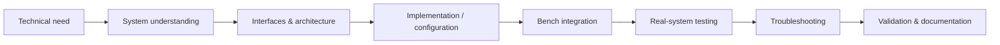

# Ahmed Hanachi — Engineering Portfolio

**System Integration Engineer — Robotics, Automation & Real-World HW/SW Systems**

I work at the interface between software, sensors, embedded/industrial hardware and real-world operation. My strength is taking complex technical systems from **partially understood or prototype state** to **integrated, testable and validated platforms**.

My background combines automotive engineering, robotics and field system integration. I have worked on autonomous vehicles, remote driving, multi-sensor systems, CAN-based interfaces, industrial controllers, camera/video pipelines, data acquisition and system validation.

[LinkedIn](https://www.linkedin.com/in/ahmed-hanachi-b3a340187/) · [GitHub](https://github.com/medman09) · ahmedhanachi09@gmail.com

---

## What I do

My work typically includes:

- HW/SW system integration and retrofit
- CAN bus interfaces and reverse engineering
- ROS / ROS 2 and Autoware integration
- Linux-based embedded and multi-PC systems
- LiDAR, IMU, GNSS-RTK and camera integration
- PLC / CODESYS-based control and I/O
- Data acquisition, logging and test tooling
- Low-latency video and networked systems
- Commissioning, troubleshooting and field validation
- Technical documentation and knowledge transfer

I use **Python and C++ as engineering tools**, rather than positioning myself as a pure software developer.

---

## Selected projects

### 1. Autonomous Shuttle System Integration — EasyMile EZ10 / ROS 2 / Autoware
**System integration · CAN · ROS 2 · Autoware · Linux · sensors · deployment · validation**

Retrofitted and integrated an autonomous shuttle platform around an open ROS 2 / Autoware architecture, including vehicle communication, sensor integration, multi-PC configuration, localization/mapping support, operator tooling and field validation.

**Result:** autonomous operation was validated on a private site at speeds up to 30 km/h. The technical architecture and know-how were later transferred to an industrial partner for reuse on more than ten similar vehicles.

[Read case study →](projects/01-autonomous-shuttle-integration/README.md)

---

### 2. Remote Vehicle Teleoperation Platform
**Teleoperation · six cameras · NVIDIA Jetson · GStreamer · WebRTC · Qt · CAN · 4G/5G**

Designed and integrated a vehicle teleoperation architecture combining multi-camera video, onboard computing, operator GUI, remote control commands and vehicle feedback over mobile networks.

**Result:** the platform supported real remote-driving experiments, with approximately 80 ms round-trip time observed under favorable network conditions.

[Read case study →](projects/02-remote-vehicle-teleoperation/README.md)

---

### 3. Camera Calibration & Validation Framework
**Camera calibration · OpenCV · ChArUco · PnP · validation · C++ tooling**

Built an engineering workflow for camera calibration that goes beyond a single RMS value by combining dataset quality, hold-out validation and physical distance checks.

The focus of this project is **measurement quality and validation methodology**, not computer-vision algorithm research.

[Read case study →](projects/03-camera-calibration-validation/README.md)

---

### 4. Automotive Instrumentation & Test Automation
**Instrumentation · pressure · temperature · Coriolis flow · CAN · PLC · logging · test procedures**

Integrated an onboard measurement architecture for an automotive thermal-system R&D project, combining sensors, industrial control, data acquisition and test procedures on a real vehicle.

The industrial partner and proprietary system details are intentionally anonymized.

[Read case study →](projects/04-automotive-test-automation/README.md)

---

### 5. Renault Twizy — Vehicle Control to Autonomous Driving
**ROS · CAN · CODESYS · vehicle control · LiDAR · Autoware · real-vehicle testing**

Developed an early vehicle-control architecture around a Renault Twizy, first using an external controller/PLC/CAN chain and later moving toward a ROS / Autoware autonomous-driving setup.

**Result:** the vehicle completed a short previously recorded trajectory autonomously in a controlled environment.

[Read case study →](projects/05-autonomous-twizy/README.md)

---

## Engineering approach

I am strongest when a project requires understanding and connecting several technical domains rather than implementing one isolated algorithm.

A typical workflow is:

### AI-assisted development

I use AI-assisted development as a productivity tool for parts of implementation, refactoring, documentation and test scaffolding.

I remain responsible for the aspects that define my engineering work:

- understanding the physical system and operational need
- defining interfaces and integration architecture
- reviewing and adapting generated implementation
- connecting software to real hardware
- troubleshooting failures
- designing tests
- validating behavior on the actual system
- documenting and transferring the solution

This portfolio therefore focuses on **engineering ownership and validated system outcomes**, not on claiming that every line of software was written manually from scratch.

---

## Technical areas

| Area | Practical experience |
|---|---|
| System integration | HW/SW integration, retrofit, commissioning, troubleshooting |
| Robotics | ROS, ROS 2, Autoware, mobile robotic platforms |
| Vehicle interfaces | CAN, command/status translation, heartbeat, diagnostics |
| Sensors | LiDAR, IMU, GNSS-RTK, industrial/automotive cameras |
| Automation | CODESYS, PLC logic, digital/analog I/O, actuators |
| Software tools | Python, C++, Qt, Linux, Git |
| Vision & video | OpenCV, camera calibration, GStreamer, WebRTC |
| Validation | logging, test plans, field trials, root-cause analysis |

---

## Scope and confidentiality

Several projects were carried out in university/industrial collaborations. Public case studies have therefore been deliberately generalized.

This repository does **not** publish:

- proprietary CAN databases or command mappings
- internal network addresses or credentials
- confidential client data
- private source repositories
- partner-specific test results that are not public
- copied upstream/vendor code presented as my own work

Project and product names remain the property of their respective owners.
