# Ahmed Hanachi — Hardware Automation & Systems Integration Portfolio

**Automation & Systems Integration Engineer | Hardware Control · Python/C++ Integration · Robotics · Instrumentation**

I build and debug software/hardware systems that have to work on real machines.

My strongest experience is bringing poorly documented devices and multi-component platforms online: understanding interfaces, reverse-engineering protocols, connecting sensors, controllers and embedded computers, building the software needed to control and observe them, validating failure modes, and testing the complete system on physical hardware.

My background is in automotive engineering and robotics, but the recurring engineering problem throughout my work has been broader: turning heterogeneous hardware and software into **reliable, testable and maintainable automated systems**.

My recent development workflow is AI-native. I use coding agents extensively for implementation and refactoring while retaining responsibility for requirements, architecture, interface contracts, review, testing, troubleshooting and real-system validation.

[LinkedIn](https://www.linkedin.com/in/ahmed-hanachi-b3a340187/) · [GitHub](https://github.com/medman09) · ahmedhanachi09@gmail.com

---

## What this portfolio demonstrates

### Reverse engineering
Taking poorly documented physical systems from unknown interfaces to understood command/status behavior and working software boundaries.

### Hardware control & software integration
Using Python, C++, CAN, ROS 2, industrial controllers and Linux systems to connect software to sensors, actuators, embedded computers and complete machines.

### Reliability & troubleshooting
Separating failures across application logic, communication, device state, networking, configuration and physical hardware, then validating recovery paths rather than only the nominal case.

### Verification
Characterization tests, fake devices, regression tests, build checks, controlled bench validation and staged validation on the target hardware.

### AI-native engineering
Using coding agents as part of a constrained engineering workflow: explicit scope, interface contracts, tests, review, acceptance criteria and human validation before deployment.

---

## Selected projects

### 1. Physical Test Automation & Instrumentation
**Instrumentation · industrial control · Python tooling · CAN · data acquisition · logging · validation**

Designed and integrated a real-vehicle R&D measurement and control architecture combining pressure and temperature sensors, Coriolis flow measurement, an industrial controller/PLC, vehicle CAN data, logging, monitoring and structured test procedures.

The important engineering problem was not the vehicle itself: it was creating a traceable automation and measurement chain from **physical signals → controller/software → recorded data → engineering decision**.

[Read case study →](projects/04-automotive-test-automation/README.md)

---

### 2. Reverse-Engineered Hardware Interface — EasyMile Shuttle
**Reverse engineering · CAN · C++ · driver architecture · ROS 2 · regression testing · physical validation**

Reverse-engineered a poorly documented vehicle interface, characterized existing CAN behavior, and progressively separated hardware-specific protocol handling from ROS/Autoware orchestration. The work included receive-frame validation, command/status translation, reusable CAN conversion logic, adapter boundaries and staged regression testing before physical validation.

The same platform was integrated with ROS 2 / Autoware and validated in autonomous operation up to 30 km/h. The architecture and know-how were later transferred to an industrial partner for reuse on more than ten similar vehicles.

[Read case study →](projects/01-autonomous-shuttle-integration/README.md)

---

### 3. Python HMI & Operational Control
**Python · HTTP interfaces · state management · error handling · testing · physical-system operations**

Refactored and hardened an operational touchscreen HMI used with a real autonomous vehicle. The software includes validated runtime configuration, an isolated HTTP bridge client, explicit application state, background communication, stale-result rejection, automatic reconnection, tracked worker lifecycle and clean shutdown behavior.

The current validated milestone includes **80 passing tests** plus connected and disconnected loopback validation, with generic software tests designed specifically to avoid sending operational commands to the vehicle.

[Read case study →](projects/06-python-hmi-operational-control/README.md)

---

### 4. Remote Vehicle Teleoperation Platform
**Teleoperation · six cameras · NVIDIA Jetson · GStreamer · WebRTC · Qt/C++ · CAN · 4G/5G**

Integrated a complete remote-driving chain combining multi-camera video, embedded computing, operator interaction, vehicle command and feedback paths, mobile networking and real-vehicle validation.

The project is included here mainly as evidence of **cross-domain troubleshooting**: failures could originate in video encoding, packet transport, application behavior, control interfaces, networking or the physical platform, requiring end-to-end diagnosis rather than isolated software debugging.

[Read case study →](projects/02-remote-vehicle-teleoperation/README.md)

---

### 5. AI-Native Software Engineering Workflow — Personal Platform Project
**Python/FastAPI · Vue/TypeScript · PostgreSQL · Docker · Git/PR workflow · tests · CI · human approval**

A personal software platform is used as a practical environment to improve my software-engineering discipline while working extensively with coding agents. The project includes versioned database migrations, role/permission boundaries, unit/integration/E2E testing, deployment readiness checks, structured pull requests, rollback considerations and explicit human approval for sensitive actions.

I include this project **not as a claim that I manually authored every line of a large full-stack codebase**, but as evidence of how I work with coding agents: define scope and constraints, review changes, enforce tests, preserve invariants, investigate failures and decide whether a change is safe to accept.

[Read case study →](projects/07-ai-native-software-engineering/README.md)

---

## Additional engineering work

### Camera Calibration & Validation Framework
**OpenCV · ChArUco · C++ · hold-out validation · physical measurement checks**

Built a reproducible calibration workflow focused on data quality and validation rather than trusting a single global calibration metric.

[Read case study →](projects/03-camera-calibration-validation/README.md)

### Renault Twizy — Vehicle Control to Autonomous Driving
**CODESYS · CAN · ROS · C++/Python · LiDAR · Autoware · real-vehicle testing**

An earlier vehicle-automation project showing the progression from PLC/CAN vehicle control toward ROS/Autoware-based autonomous operation.

[Read case study →](projects/05-autonomous-twizy/README.md)

---

## Engineering approach

A recurring pattern across my physical-system projects is:

```mermaid
flowchart LR
    A[Physical system / technical need] --> B[Understand behavior]
    B --> C[Identify interfaces & constraints]
    C --> D[Define software boundary]
    D --> E[Implement / configure]
    E --> F[Test without hardware where possible]
    F --> G[Bench integration]
    G --> H[Physical-system validation]
    H --> I[Troubleshoot / refine]
    I --> J[Document & transfer]
```

I am strongest when the failure cannot be solved by looking at only one layer. A real integration issue may involve software logic, timing, networking, protocol state, sensor behavior, controller configuration, wiring or the physical machine itself.

---

## AI-native development workflow

Coding agents are part of my normal engineering workflow. I use them for codebase exploration, implementation, refactoring, test generation and technical documentation.

My responsibility is to:

- define the engineering problem, constraints and acceptance criteria
- choose the system and interface architecture
- protect existing behavior through characterization and regression tests
- review generated changes and keep scope bounded
- reproduce failures and distinguish symptoms from root causes
- test nominal, boundary and error paths
- validate behavior against a controlled simulator, fake device or target hardware as appropriate
- keep assumptions, limitations and unverified behavior explicit

For hardware-facing projects, generated code is never considered correct because it looks plausible or passes a static check. Correctness is established through repeatable tests, interface-level verification and, where required, staged validation on the physical system.

This workflow has allowed me to expand the amount and quality of software I can build while keeping engineering ownership, safety boundaries and final technical decisions under human control.

---

## Technical areas

| Area | Practical experience |
|---|---|
| Physical systems integration | HW/SW integration, retrofit, commissioning, troubleshooting |
| Hardware interfaces | CAN, HTTP/service interfaces, command/status translation, state handling |
| Software | Python, C++, Qt, Linux, Git/GitHub |
| Automation | CODESYS, PLC logic, digital/analog I/O, sensors and actuators |
| Robotics | ROS, ROS 2, Autoware, embedded/mobile robotic platforms |
| Instrumentation | pressure, temperature, flow, vehicle/system data acquisition |
| Sensors | LiDAR, IMU, GNSS-RTK, industrial/automotive cameras |
| Reliability | logging, error paths, reconnect/recovery, configuration validation |
| Verification | characterization tests, regression tests, test plans, field trials |
| Vision & video | OpenCV, camera calibration, GStreamer, WebRTC |

---

## Scope and confidentiality

Several projects were carried out in university/industrial collaborations. Public case studies are therefore deliberately generalized and focus on transferable engineering methods rather than proprietary implementation details.

This repository does **not** publish:

- proprietary CAN databases, command mappings or safety-sensitive control details
- internal network addresses, credentials or production secrets
- confidential client/partner data
- private source repositories
- partner-specific test results that are not public
- copied upstream/vendor code presented as my own work

Where AI-assisted implementation was used, I state that openly and focus on the engineering decisions, validation evidence and system outcomes for which I can take responsibility.

Project and product names remain the property of their respective owners.
