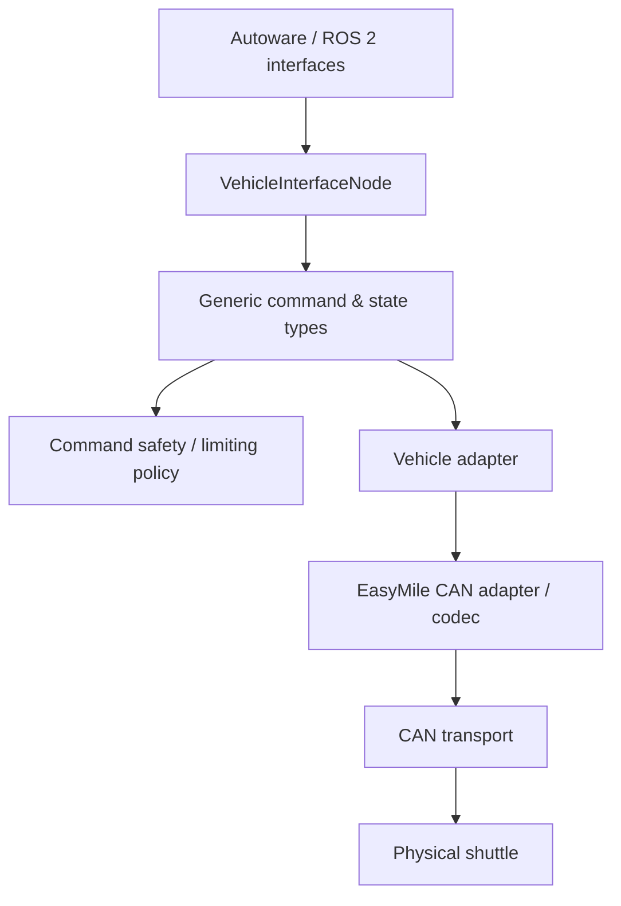
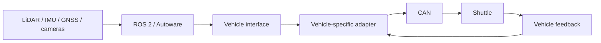

# Reverse-Engineered Hardware Interface — EasyMile Shuttle

[← Back to portfolio](../../README.md)

## Overview

This project started with a poorly documented autonomous shuttle that could not be independently controlled or integrated at the level needed for an open research platform.

My work combined **protocol understanding, CAN reverse engineering, driver/interface development, system integration, regression testing, multi-sensor deployment and physical validation**.

The important engineering pattern was:

> understand an existing black-box interface → characterize current behavior → create a clean software boundary → protect behavior with tests → refactor safely → validate progressively on the real machine.

The same platform was later integrated with ROS 2 / Autoware and validated in autonomous operation.

---

## Starting point

Key questions were initially unresolved:

- Which messages actually commanded the vehicle?
- Which state/feedback messages were required?
- How did heartbeat and arming/enabling behavior work?
- What happened when commands were malformed, stale or inconsistent with vehicle state?
- How could vehicle-specific CAN logic be separated from higher-level robotics software?
- How could changes be tested without discovering regressions only during vehicle trials?

An early practical result was replacing the original short-range remote-control concept with a longer-range solution validated during real manual driving. The same system understanding later enabled software-based control from ROS/Autoware.

---

## Interface architecture

The historical implementation mixed several responsibilities inside ROS 2 node code:

- ROS parameters, publishers, subscribers, services and timers
- Autoware command handling
- command limiting
- byte-level CAN encoding and decoding
- vehicle state storage
- heartbeat behavior
- gear/accessory handling

That implementation worked, but made isolated testing and safe modification harder.

The refactoring direction was to introduce explicit boundaries:

The goal was not architecture for its own sake. It was to make hardware-specific protocol behavior **understandable, reusable and testable independently from the robotics framework**.

---

## My contribution

### Reverse engineering

I investigated vehicle CAN behavior and identified the system-level elements required for external control, including:

- command messages
- vehicle status feedback
- heartbeat behavior
- arming / enabling sequences
- timeout behavior
- practical command limits
- relationships between requested and reported vehicle state

Proprietary IDs, byte mappings and safety-sensitive command details are intentionally excluded from this public portfolio.

### Characterization before modification

Before changing deployed behavior, the existing implementation was progressively characterized with tests covering areas such as:

- velocity and steering decoding
- gear and signal state
- driving-command payloads
- door / heartbeat behavior
- accessory frames
- receive-frame handling
- malformed/unsupported frame behavior

This created a reference against which refactoring could be compared.

### Driver / codec extraction

Hardware-specific byte-level CAN logic was then separated into smaller components so it could be exercised without a complete ROS 2 runtime.

The extracted logic covers responsibilities such as:

- frame validation
- command payload encoding
- status decoding
- heartbeat generation
- vehicle-specific identifiers and DLC expectations

Generic command/state types and an adapter boundary were introduced progressively so higher-level logic would depend less directly on EasyMile-specific protocol details.

### Receive-path hardening

The receive path was hardened so malformed or unrelated frames could not silently update vehicle state. Validation addressed concerns such as:

- unsupported identifiers
- incorrect frame metadata
- invalid DLC
- fixed payload boundaries
- preserving state when a frame is rejected

### Regression and staged validation

The validation strategy deliberately separated software-only checks from physical testing:

1. characterize existing behavior
2. build and run focused tests
3. preserve historical regression tests
4. validate pure protocol/adapter components independently
5. perform CAN bench comparison where appropriate
6. validate stationary vehicle behavior
7. proceed to controlled low-speed/dynamic tests only after earlier stages pass

This staged approach reduces the cost and risk of finding a software regression for the first time on a moving vehicle.

---

## Full-system integration

The driver/interface work was one part of a larger system-integration effort. I also integrated and commissioned:

- ROS 2 / Autoware Universe
- LiDAR, IMU, GNSS-RTK and cameras
- Linux embedded computers
- Ethernet / DDS communication
- mapping and localization
- logging and diagnostics
- operator/HMI tooling
- repeatable startup and deployment configuration

---

## Results

- poorly documented vehicle behavior made usable for software-based control
- reverse-engineered CAN interface integrated into an open robotics architecture
- autonomous operation validated on a private site at speeds up to **30 km/h**
- progressively testable protocol/adapter boundaries introduced around historical code
- repeatable logging, configuration and diagnostic workflows
- one-month on-site knowledge transfer to an industrial partner in Germany
- continued support for reuse of the concept on **more than ten similar vehicles**

---

## Technologies

`C++` · `CAN` · `ROS 2` · `Autoware Universe` · `Linux` · `CTest / gtest` · `Git` · `CycloneDDS` · `Ethernet` · `LiDAR` · `IMU` · `GNSS-RTK` · `Python` · `Qt`

---

## Engineering scope & ownership

My strongest ownership in this project is:

- functional reverse engineering of a poorly documented physical system
- definition and evolution of the vehicle software interface
- CAN command/status interpretation and validation
- driver/adapter architecture decisions
- characterization and regression-test strategy
- integration with ROS 2 / Autoware
- sensor/computer/network integration
- troubleshooting and field validation
- operational procedures and knowledge transfer

AI-assisted development was used for parts of later implementation, refactoring, testing and documentation. My responsibility remained the system behavior to preserve, architecture and interface decisions, review of generated changes, validation criteria, debugging and final acceptance on the target platform.
