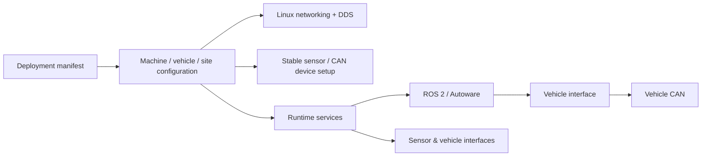

# Autonomous Shuttle System Integration — EasyMile EZ10 / ROS 2 / Autoware

[← Back to portfolio](../../README.md)

## Overview

This project involved progressively transforming a poorly documented autonomous shuttle into an open, maintainable research platform based on ROS 2 and Autoware.

My role centered on **system understanding, retrofit, HW/SW integration, vehicle communication, multi-sensor integration, deployment, troubleshooting and field validation**.

The software implementation was one part of a larger engineering problem: making a real vehicle, sensors, computers, networks and an autonomous-driving stack operate together reliably.

---

## Starting point

The shuttle was acquired without the level of system documentation needed to independently operate and modify the platform.

Key challenges included:

- understanding the vehicle command and status interfaces
- identifying critical CAN messages, heartbeat behavior and arming sequences
- replacing parts of the original onboard computing architecture
- integrating external sensors and an open autonomous-driving stack
- operating a multi-computer ROS 2 system reliably in the field
- keeping configurations reproducible across test campaigns

---

## My contribution

### Vehicle reverse engineering and control interface

I investigated the vehicle CAN communication to identify the behavior needed for safe external control, including:

- command messages
- vehicle status feedback
- heartbeat signals
- arming / enabling sequences
- timeout behavior
- practical command limits

An early result was the replacement of the original short-range remote-control solution with a longer-range radio-control concept validated during real manual driving.

The same system understanding later supported the interface between Autoware and the vehicle.

### Autonomous-driving integration

I integrated an open ROS 2 / Autoware architecture with the shuttle and its surrounding hardware.

Work included:

- ROS 2 / Autoware integration
- vehicle command/status interfacing through CAN
- LiDAR, IMU, GNSS-RTK and camera integration
- mapping and localization support
- configuration and launch profiles
- logging and diagnostic tooling
- operator/HMI support
- bench and field validation

### Multi-PC deployment and configuration

The platform evolved toward a declarative configuration model that separated:

- **machine** configuration
- **vehicle** configuration
- **site/map** configuration
- runtime **role/profile**
- autonomous-driving **stack**

This reduced scattered configuration and made field setups easier to reproduce.

The real internal network addresses, device names and proprietary CAN details are intentionally omitted.

### Field operations

I also worked on the operational side of the platform:

- repeatable startup profiles
- recording/logging support
- version tracking for test configurations
- troubleshooting
- field-test documentation
- incident and test-run traceability

---

## Engineering challenges

### 1. Black-box vehicle behavior

The vehicle could not simply be commanded by sending steering and speed values. Correct operation also depended on state, heartbeat and enable/arming behavior.

**Engineering lesson:** understand the complete command state machine before trying to automate control.

### 2. Integration across domains

A localization or control problem could originate from:

- sensor data
- transforms/calibration
- network/DDS configuration
- device naming
- time synchronization
- map/configuration mismatch
- CAN interface state
- autonomous-stack parameters

Troubleshooting therefore required a system-level view rather than focusing on one software component.

### 3. Reproducible field configuration

Multi-PC robotic systems become difficult to maintain when network, device and launch configuration is scattered across machines.

The platform was progressively reorganized toward explicit configuration and manifests so that a test setup could be reproduced from versioned artifacts.

---

## Results

- autonomous driving validated on a private site
- operation at speeds up to **30 km/h**
- real multi-sensor ROS 2 / Autoware integration
- repeatable test, logging and diagnostic workflows
- technical documentation and knowledge transfer
- one-month on-site knowledge transfer to an industrial partner in Germany
- continued support for reuse of the concept on **more than ten similar vehicles**

---

## Technologies

`ROS 2` · `Autoware Universe` · `CAN` · `Linux` · `CycloneDDS` · `Ethernet` · `LiDAR` · `IMU` · `GNSS-RTK` · `Python` · `C++` · `Qt` · `Git`

---

## What I can defend technically

My strongest ownership in this project is:

- system architecture and interfaces
- CAN reverse engineering at functional/system level
- sensor and computer integration
- ROS 2 / Autoware deployment and configuration
- troubleshooting
- mapping/localization integration
- field validation
- operational procedures and knowledge transfer

I used software development — including AI-assisted implementation where useful — as a means to solve these integration problems. I do not present this project as evidence that I developed the Autoware algorithms themselves.
