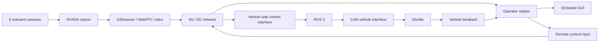

# Remote Vehicle Teleoperation Platform

[← Back to portfolio](../../README.md)

## Overview

The objective was to support remote driving and tele-assisted operation of an automated shuttle over mobile networks.

The system combined:

- six onboard cameras
- an NVIDIA Jetson embedded computer
- low-latency video transport
- an operator station
- remote control commands
- vehicle feedback/status
- ROS 2 and CAN interfaces

The main engineering challenge was not one isolated software module; it was making **video, networking, operator interaction and vehicle control work together on a real platform**.

This project is included in the portfolio mainly as evidence of cross-domain troubleshooting: a visible symptom at the operator station could originate in camera capture, encoding, packet transport, application behavior, command routing, ROS/CAN communication or the physical vehicle.

---

## System architecture



Internal IP addresses, VPN credentials and proprietary vehicle mappings are intentionally excluded.

---

## My contribution

My work focused on the end-to-end integration:

- camera and onboard-compute integration
- video-pipeline setup and testing
- operator-side GUI integration
- remote command path
- vehicle feedback/status path
- ROS 2 / CAN connection to the vehicle
- network testing over 4G/5G
- latency measurement
- real-vehicle test support and troubleshooting

Software components included Python, C++ and Qt code. AI-assisted development was used for parts of implementation and refactoring; my responsibility remained the architecture, interface behavior, review, integration, debugging and validation on the real system.

---

## Engineering challenges

### Low-latency video

Teleoperation requires a different design mindset from ordinary video streaming. The main trade-offs are:

- image quality
- bitrate
- frame rate
- latency
- packet loss sensitivity
- network variability

The system was tested over mobile networks and tuned for practical driving/supervision rather than maximum visual quality.

### Network behavior and root-cause isolation

A later dedicated prototype reproduced an important WebRTC troubleshooting case over VPN: signaling and ICE connection could be established while full video frames were not reconstructed reliably.

A reduced sender profile with approximately:

- 640 × 360 video
- 15 fps
- VP8 around 250 kbit/s
- RTP MTU around 1200 bytes

was validated as a practical workaround for the lab network conditions.

The useful engineering lesson was not the exact bitrate. It was the diagnostic method: separate the problem into stages and identify which layer is actually failing.

```text
camera capture
    ↓
encoder
    ↓
RTP / network transport
    ↓
receiver
    ↓
decoder
    ↓
application rendering
```

That same approach is transferable to other integrated systems: do not treat “the device is not working” as one failure domain.

### Vehicle-control safety

Remote driving is not only a networking problem. A usable design needs to consider:

- stale/lost commands
- operator intent
- vehicle feedback
- enabling/disabling control
- communication loss
- safe fallback behavior
- validation before real driving

### Reproducible development and validation

Later software work around the teleoperation stack was organized with explicit architecture documentation, build/test procedures and focused validation rather than changing the whole application at once. The goal was to make failures reproducible and preserve known behavior while individual components evolved.

---

## Results

- real remote-driving / tele-assisted experiments supported on the shuttle
- six-camera onboard setup
- NVIDIA Jetson-based video processing/streaming
- 4G/5G communication trials
- approximately **80 ms round-trip time** observed under favorable network conditions
- platform used to support applied research related to remote driving of automated vehicles

---

## Technologies

`ROS 2` · `CAN` · `NVIDIA Jetson` · `GStreamer` · `WebRTC` · `Qt` · `C++` · `Python` · `4G/5G` · `Linux`

---

## Engineering scope & ownership

My ownership in this project includes:

- end-to-end teleoperation architecture and integration
- video-pipeline configuration and practical tuning
- operator-to-vehicle command and feedback paths
- ROS 2 / CAN connection to the physical platform
- network testing and latency measurement
- failure isolation across video, network, application and vehicle layers
- real-system test planning and troubleshooting

The project demonstrates integration and diagnostic ownership across several technologies rather than expertise in implementing the WebRTC protocol stack itself.
