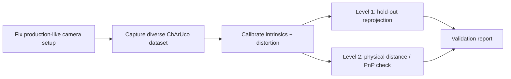
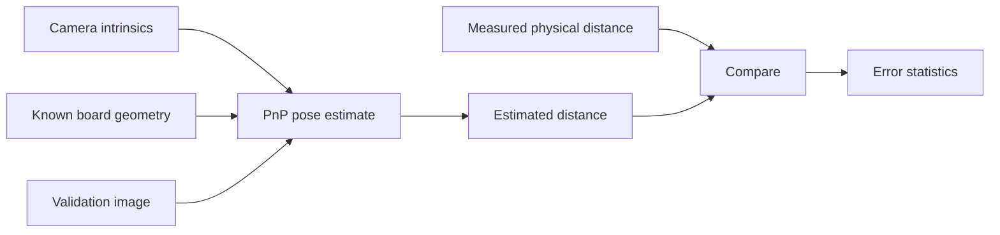

# Camera Calibration & Validation Framework

[← Back to portfolio](../../README.md)

## Overview

This project addresses a practical engineering question:

> How can I verify that a camera calibration is useful and repeatable on the real setup, rather than trusting one global RMS value?

The workflow uses a ChArUco target and OpenCV-based tooling, but the main focus is **data quality, validation and traceability**.

---

## Workflow

---

## Calibration procedure

The acquisition procedure emphasizes:

- rigid calibration target
- measured square dimensions
- fixed/controlled focus where possible
- production-like resolution and camera settings
- coverage of image center, edges and corners
- near/far distances
- varied pitch, roll and rotation
- avoidance of blur and overexposure

This is important because poor acquisition cannot be repaired by a more complex calibration command.

---

## Validation level 1 — Hold-out reprojection

Instead of evaluating only the images used to estimate the calibration, a separate dataset is used to check whether the intrinsics and distortion generalize to new images.

The workflow tracks:

- train/test image lists
- per-image reprojection statistics
- median error
- upper-percentile behavior
- obvious outliers

The purpose is to identify issues such as:

- insufficient dataset coverage
- focus changes
- blur
- wrong target parameters
- overfitting

---

## Validation level 2 — Physical distance check

A second validation estimates the target pose using the known ChArUco geometry and compares the estimated translation against a physically measured camera-to-target distance.

This does not replace a full metrology-grade calibration procedure, but it provides a useful real-world consistency check.

---

## My contribution

The engineering contribution includes:

- defining the calibration workflow
- structuring acquisition and validation steps
- creating/organizing the toolchain
- integrating OpenCV/ChArUco functionality
- defining reporting outputs
- reproducible configuration
- validation methodology

Parts of the C++ implementation, project structure, refactoring and test scaffolding were created with AI-assisted development.

I therefore present this project as evidence of **vision-system integration and validation methodology**, not as evidence that I am a computer-vision algorithm researcher.

---

## Technologies

`C++` · `OpenCV` · `ChArUco` · `PnP` · `CMake` · `YAML` · `Docker` · `CI`

---

## What I can defend technically

I can explain:

- why camera calibration is needed
- intrinsics and distortion at an engineering level
- why varied calibration poses matter
- why validation should use independent data
- what reprojection error tells us
- why a physical distance check is useful
- how focus/resolution/setup changes invalidate assumptions

I do not claim expertise in deriving or implementing the underlying nonlinear optimization or projective-geometry algorithms from scratch.
