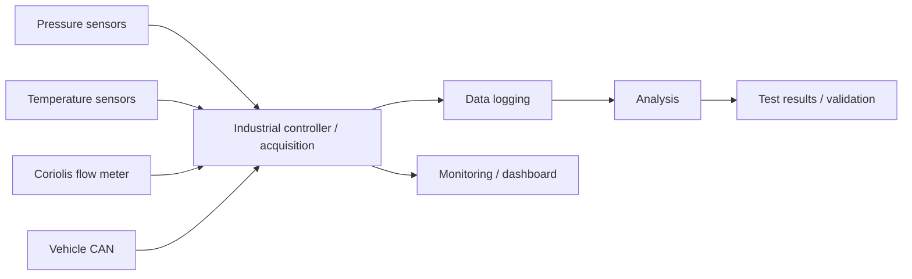

# Automotive Instrumentation & Test Automation

[← Back to portfolio](../../README.md)

## Overview

This project concerns the integration and validation of a new automotive thermal-system component on a real vehicle in an industrial R&D context.

The partner and proprietary component details are intentionally anonymized.

My responsibility focused on the **measurement architecture, sensor integration, control/data acquisition chain, test preparation and real-vehicle validation**.

---

## Measurement objective

The test setup needed to capture the physical quantities required to evaluate system performance, including:

- refrigerant pressure
- temperature
- mass/flow information using a Coriolis flow meter
- vehicle/system CAN data
- operating state
- derived performance indicators such as COP

The system included **two pressure measurements, two temperature measurements and one Coriolis flow measurement**.

---

## Simplified architecture

Exact wiring, internal signal names, partner information and proprietary vehicle data are excluded.

---

## My contribution

My work includes:

- identifying the required measurements
- integrating pressure, temperature and flow sensors
- power and signal-distribution planning
- controller / PLC integration
- CAN data integration
- data logging
- dashboard/monitoring support
- measurement procedures
- test planning
- compatibility checks
- real-vehicle instrumentation
- troubleshooting during integration

Implementation tools include industrial-controller programming, data-processing scripts and dashboard tooling. AI-assisted development is used where useful to accelerate implementation and documentation; the core responsibility remains the physical integration, signal mapping, test design and validation.

---

## Engineering considerations

### Signal integrity and power distribution

Vehicle environments require attention to:

- supply-voltage variation
- grounding
- sensor power
- fuse/protection strategy
- cable routing
- shield handling
- analog/digital signal integrity

### Traceable measurements

Useful data acquisition requires more than reading sensor values. The setup also needs:

- known units and scaling
- synchronized timestamps
- identifiable operating conditions
- repeatable logging
- sensor plausibility checks
- documented test procedures

### Real-system validation

A measurement system is only useful when it can support a decision about the physical system. The objective was therefore to connect instrumentation results to system-performance evaluation, including COP-related measurements.

---

## Technologies

`CODESYS / PLC` · `CAN` · `pressure sensing` · `temperature sensing` · `Coriolis flow` · `data acquisition` · `logging` · `Python` · `dashboard tooling`

---

## What I can defend technically

I can explain:

- why each measurement is needed
- how sensors are powered and interfaced
- CAN versus analog/digital measurement paths
- grounding/protection considerations
- logging and data traceability
- how to define a practical test plan
- how to troubleshoot implausible measurements
- how system validation differs from simply collecting data

I do not present this case study as a pure PLC-software or embedded-firmware development project.
