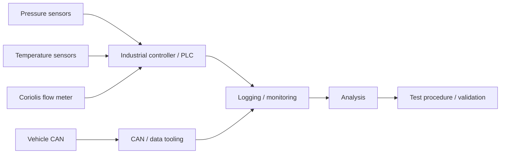

# Physical Test Automation & Instrumentation

[← Back to portfolio](../../README.md)

## Overview

This project concerns the integration and validation of a new thermal-system component on a real vehicle in an industrial R&D context. The partner and proprietary component details are intentionally anonymized.

The engineering problem was broader than installing sensors: build a **traceable measurement and control chain** that could acquire physical signals, combine them with vehicle/system data, support repeatable test procedures and produce evidence suitable for an engineering decision.

My responsibility focused on the measurement architecture, sensor integration, controller/PLC interface, CAN data path, logging/monitoring, test preparation and real-system validation.

---

## Automation objective

The setup needed to capture and correlate several physical quantities:

- refrigerant pressure
- temperature
- mass/flow information using a Coriolis flow meter
- vehicle/system CAN data
- operating state
- derived performance indicators such as COP

The implemented measurement chain included **two pressure measurements, two temperature measurements and one Coriolis flow measurement**, together with controller and vehicle data.

---

## Simplified architecture



Exact wiring, proprietary signal names, partner information and vehicle-specific data are excluded.

---

## My contribution

### Measurement architecture

I translated the validation objective into a practical measurement chain:

- identified the required physical quantities
- selected and integrated pressure, temperature and flow measurements
- planned power and signal distribution
- integrated the industrial controller / PLC
- connected vehicle/system CAN information
- defined the logging and monitoring path
- supported data analysis and performance validation

### Hardware integration

The vehicle environment required practical attention to:

- supply-voltage variation
- sensor power and protection
- grounding and shield handling
- cable routing
- analog/digital signal integrity
- mechanical installation constraints
- serviceability during test campaigns

### Software & data tooling

The project also used software tooling around the physical system for tasks such as:

- CAN data handling
- measurement/log conversion
- diagnostics and sanity checks
- repeatable test preparation
- data organization and analysis support

Python was used as an engineering tool around the acquisition and CAN workflow, while CODESYS/PLC logic handled controller-side functions.

### Test design

A useful measurement system needs more than sensor readings. I therefore worked on:

- units and scaling
- timestamp/operating-condition traceability
- repeatable logging
- sensor plausibility checks
- test procedures
- acceptance criteria
- troubleshooting steps when measurements were inconsistent

---

## Why this project is relevant beyond automotive

The physical domain is automotive, but the integration pattern is generic:

```text
Physical device / process
        ↓
Sensors + controller
        ↓
Communication interfaces
        ↓
Acquisition / monitoring software
        ↓
Logging + validation rules
        ↓
Engineering decision
```

That same pattern applies to laboratory automation and automated scientific instrumentation: several heterogeneous devices must expose trustworthy state, be orchestrated reproducibly and fail in ways that can be diagnosed.

---

## Engineering challenges

### Signal integrity and installation

A technically correct sensor can still produce unusable measurements if power, grounding, scaling, shielding or installation are wrong. Integration therefore included both software/data checks and physical inspection.

### Traceability

Recorded data needed enough context to explain what the system was doing when a value was measured. Test conditions, units, timestamps and configuration were therefore treated as part of the measurement system rather than as afterthoughts.

### Real-system troubleshooting

Unexpected results can originate from the sensor, wiring, controller configuration, CAN data path, logging tool, operating condition or the physical system itself. Debugging required checking the complete chain.

---

## Technologies

`CODESYS / PLC` · `CAN` · `Python` · `pressure sensing` · `temperature sensing` · `Coriolis flow` · `data acquisition` · `logging` · `monitoring` · `test procedures`

---

## Engineering scope & ownership

My ownership in this project includes:

- translating the physical test objective into a measurement architecture
- sensor/controller/CAN integration
- signal and data-path definition
- software tooling around acquisition and diagnostics
- test planning and acceptance criteria
- troubleshooting across hardware and software
- real-vehicle validation
- maintaining confidentiality around partner-specific implementation details

AI-assisted development was used for parts of implementation and documentation. I retained responsibility for the physical architecture, signal mapping, constraints, review, tests and final validation against the real system.
