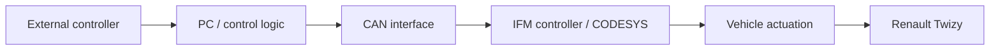
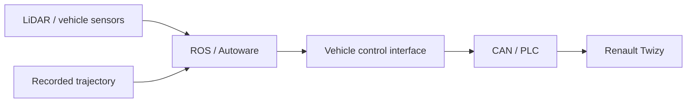

# Renault Twizy — Vehicle Control to Autonomous Driving

[← Back to portfolio](../../README.md)

## Overview

This project was part of my Bachelor work in automotive engineering and represents an early stage of my system-integration path.

The work evolved from external vehicle control through a PC/PLC/CAN architecture toward a ROS / Autoware setup capable of following a previously recorded trajectory on a real Renault Twizy.

---

## Phase 1 — External vehicle control

The first architecture connected:

- an onboard/engineering PC
- external controller input
- CAN communication
- an IFM industrial controller programmed with CODESYS
- vehicle motor/actuator control

The objective was to establish practical control of a real vehicle through an external HW/SW chain.

---

## Phase 2 — ROS / Autoware

The project then moved toward an autonomous-driving architecture based on ROS / Autoware and onboard sensing.

The final Bachelor-project objective was not a production autonomous vehicle; it was a controlled engineering demonstrator proving that the vehicle could follow a short previously recorded trajectory autonomously.

---

## My contribution

- vehicle-control architecture
- PC / PLC / CAN integration
- CODESYS-based control logic
- external controller integration
- ROS-based vehicle integration
- Autoware setup
- trajectory-following integration
- parameter tuning
- real-vehicle testing and debugging

Because this is an older project, I focus on the architecture and engineering decisions rather than claiming current expert-level knowledge of every historical API or parameter.

---

## Result

The Renault Twizy completed a short recorded trajectory autonomously in a controlled environment.

The project gave me early practical experience connecting:

**software → communication → industrial control → real vehicle behavior**

which later became central to my work on larger robotic and autonomous platforms.

---

## Technologies

`ROS` · `Autoware` · `CAN` · `CODESYS` · `IFM PLC` · `Python` · `C++` · `LiDAR` · `vehicle control`

---

## What I can defend technically

I can explain:

- why a PLC/CAN layer was used
- how external commands were translated toward vehicle control
- the difference between manual external control and autonomous path following
- the role of ROS / Autoware in the later architecture
- practical tuning and validation on a real vehicle
- the main system-integration lessons learned

I do not use this historical project to claim current specialist expertise in Autoware internals or low-level control theory.
