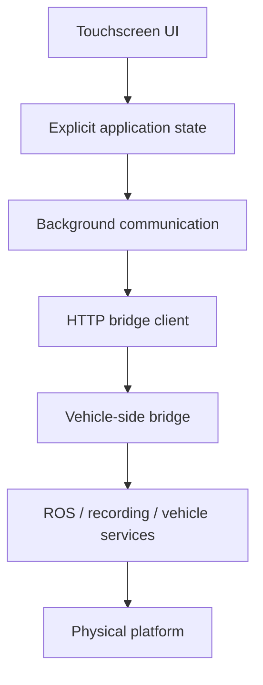

# Python HMI & Operational Control

[← Back to portfolio](../../README.md)

## Overview

This project is an operational touchscreen HMI used with a real autonomous vehicle platform. Its job is not only to display status: it must communicate with vehicle-side services, send operator actions deliberately, tolerate temporary communication failures and remain understandable and testable as the system evolves.

The project is included in this portfolio because it shows my more recent Python development workflow around a **physical system with real operational consequences**.

The software is AI-assisted, but the engineering emphasis is on explicit state, bounded behavior, error paths, testability and validation against controlled interfaces before connecting to the real platform.

---

## Simplified architecture



The public case study intentionally omits production tokens, internal addresses and operational command details.

---

## Engineering problem

The original application worked, but several software concerns needed to be made safer and easier to reason about:

- runtime configuration was scattered
- GUI and HTTP communication responsibilities were coupled
- repeated polling could overlap or interfere with commands
- background work had to interact safely with Tkinter
- delayed responses could arrive after a newer request
- disconnect/reconnect behavior needed to be explicit
- shutdown needed to avoid leaving workers or callbacks active
- tests had to prove behavior without accidentally sending real operational commands

---

## Refactoring approach

The work was deliberately split into reviewable milestones rather than a single rewrite.

### 1. Isolate the bridge client

HTTP behavior was separated from the graphical controller while preserving the existing external contract.

Characterization tests were added for:

- routes and methods
- authentication behavior
- JSON handling
- timeout/error behavior
- boundary cases

### 2. Centralize and validate runtime configuration

Configuration was moved into an explicit model with validation for values such as:

- API token presence
- bridge URL shape
- request timeout
- polling interval
- asset/image paths

Local environment files are treated as protected runtime configuration and are not committed with production secrets.

### 3. Make application state explicit

Connection, command and page-related state was formalized rather than spread across implicit UI attributes.

This made state transitions easier to test and reduced accidental coupling between GUI behavior and communication logic.

### 4. Harden background communication

The communication layer was reworked around explicit worker and request state.

Important behaviors include:

- one health poll in flight at a time
- completion-based polling instead of overlapping fixed-rate requests
- tracked background workers
- a queue for UI-thread callbacks
- stale polling-result rejection using request generations
- polling pause/refresh coordination while commands are active
- automatic reconnection polling
- recovery if a worker cannot start
- clean timer/callback/worker shutdown

---

## Example reliability pattern

A simplified version of the polling logic is:

```text
schedule poll
    ↓
check: closing? command active? poll already running?
    ↓
start one background request
    ↓
receive outcome
    ↓
queue result to UI thread
    ↓
reject if stale / superseded
    ↓
apply current state or disconnected state
    ↓
schedule next poll
```

The purpose is not sophisticated concurrency for its own sake. It is to make communication behavior deterministic enough to reason about and test.

---

## Validation strategy

A key requirement was being able to validate software without contacting the real vehicle-side computer or sending operational commands.

The test strategy includes:

- Python compilation
- unit-test discovery
- launcher syntax checks
- valid and invalid configuration cases
- missing/insecure local environment files
- connected local fake-bridge session
- disconnected loopback session
- UI page navigation
- traceback / Tkinter callback exception detection
- detection of any unexpected operational POST request

The current completed milestone records:

- **80 unit tests passing**
- connected loopback session: PASS
- disconnected loopback session: PASS
- all main HMI pages: PASS
- operational POST requests during generic validation: **0**
- traceback: NONE
- Tkinter callback exception: NONE

A later work-in-progress milestone adds focused tests around rosbag/log control and keeps physical/operational validation separate from generic software checks.

---

## Engineering rules used with coding agents

The repository contains explicit agent/development rules. Examples include:

- work on one reviewable milestone step at a time
- do not change public interfaces or operational behavior without explicit approval
- add tests for behavioral changes
- prefer simple explicit designs over premature abstractions
- keep Tkinter access on the UI thread
- do not reintroduce overlapping fixed-rate polling
- never claim runtime validation when only static checks were run
- record assumptions and unverified behavior explicitly
- preserve a rollback path before deployment
- do not send operational vehicle commands during generic software tests

A milestone is considered complete only when its scope is explicit, relevant tests pass, boundary/error paths are considered, the result is validated in the appropriate environment, the diff is reviewed and remaining limitations are documented.

---

## Technologies

`Python` · `Tkinter / CustomTkinter` · `HTTP` · `threading` · `Queue` · `dataclasses` · `Git/GitHub` · `unit tests` · `Linux` · `ROS-facing vehicle services`

---

## Engineering scope & ownership

This project demonstrates that I can work beyond one-off engineering scripts in Python. My ownership includes:

- defining the refactoring milestones and invariants to preserve
- separating communication/configuration/state responsibilities
- reviewing and adapting AI-assisted implementation
- defining failure and recovery behavior
- designing tests that avoid unsafe interaction with real hardware
- validating connected and disconnected behavior
- keeping secrets and deployment-specific values outside the repository
- deciding when software-only evidence is sufficient and when target-system validation is still required

I do not use the test count as a substitute for engineering judgment. The important evidence is that the tests are tied to real failure modes, interface contracts and operational constraints of a physical system.
