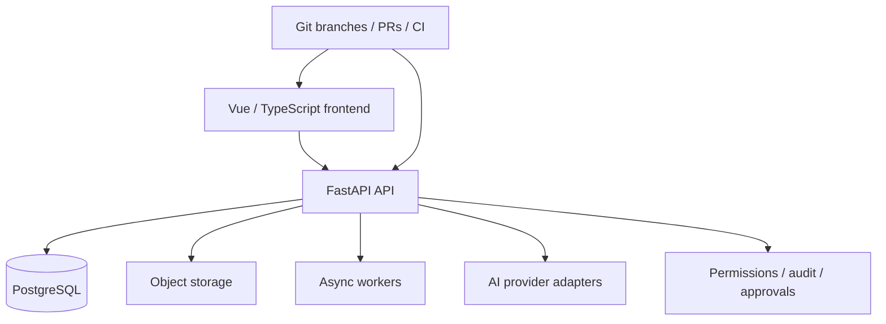

# AI-Native Software Engineering Workflow — Personal Platform Project

[← Back to portfolio](../../README.md)

## Why this case study is included

Most of my professional work is centered on physical systems. In parallel, I use a private personal software platform as a practical environment to improve my software-engineering discipline and to learn how to use coding agents productively without delegating engineering judgment to them.

This is **not presented as proof that I manually authored every line of a large full-stack application**.

It is presented as evidence of how I work when AI agents generate a significant part of the implementation: requirements are made explicit, changes are scoped, interfaces and safety boundaries are defined, tests and migration paths are required, and generated code is reviewed against the intended behavior before it is accepted.

---

## Project context

The platform is a modular business application with a Python/FastAPI backend, Vue/TypeScript frontend, PostgreSQL database, object storage, asynchronous workers and containerized deployment.

A simplified architecture is:



The project is still a supervised pilot / development system rather than a claim of a finished autonomous production product.

---

## Development model

I use coding agents for tasks such as:

- codebase exploration
- implementation from an approved specification
- refactoring
- test scaffolding
- documentation synchronization
- repetitive migration or integration work
- initial analysis of test/build failures

The agent is not given an unrestricted objective such as “make the app better”. Work is divided into bounded changes with explicit scope, invariants and acceptance criteria.

A typical iteration is:

```text
Requirement / issue
      ↓
Define scope and constraints
      ↓
Create focused branch
      ↓
Agent-assisted implementation
      ↓
Tests / lint / build
      ↓
Review diff and behavior
      ↓
Correct failures or scope drift
      ↓
Pull request with explicit summary
      ↓
Human merge / deployment decision
```

---

## Examples of engineering discipline

### Versioned data model

Database changes are handled through explicit migrations rather than untracked manual changes.

Relevant concerns include:

- migration ordering
- schema compatibility
- data isolation
- rollback / recovery considerations
- tests around migration state

### Permission and approval boundaries

The application separates user roles and protects sensitive workflows. AI-assisted actions are not treated as implicit authorization.

Examples of intentionally controlled actions include:

- external communication
- payment/financial actions
- deletion
- contractually meaningful decisions
- automated remediation
- merge/deployment of generated changes

### Operational readiness

The platform distinguishes lightweight liveness from dependency-backed readiness.

Readiness checks are designed to verify required dependencies without leaking sensitive configuration or performing unnecessary writes.

### Explicit scope in pull requests

Pull requests describe both what changes and what is intentionally unchanged. This is especially useful when coding agents are involved because it provides a contract against which generated modifications can be reviewed.

Examples of recurring PR boundaries include:

- frontend-only changes with no backend/schema modification
- preserving existing API contracts
- preserving role permissions
- not inventing data or behavior unsupported by the backend
- keeping deployment identifiers stable during UI/product changes

---

## Test strategy

The project documents a layered strategy covering:

### Unit tests

- business rules
- permissions
- parsing and schema validation
- approval policies
- configuration and limits

### Integration tests

- API + database
- migrations
- file/object storage
- jobs/workers
- provider adapters
- transactions and idempotence

### End-to-end / operational scenarios

- different user roles
- errors and recovery
- staging / controlled rollback
- diagnostic-to-PR workflows
- refusal of approval

The broader test plan also considers failure modes that are particularly relevant to agentic software development, such as:

- prompt injection
- secret exposure
- actions outside the permitted workspace
- exceeding retry/time/resource limits
- attempts to merge or deploy without approval
- regression after a proposed fix

---

## Human validation as a design rule

One of the central lessons from working with coding agents is that fast code generation makes **verification more important, not less important**.

I therefore try to separate:

- what the agent proposes
- what automated tests demonstrate
- what still needs human review
- what still needs runtime validation
- what remains an assumption

For physical-system work, this principle becomes even stricter because a green unit test cannot prove that wiring, timing, mechanical state or the real device behaves as assumed.

---

## Technologies

`Python` · `FastAPI` · `Vue 3` · `TypeScript` · `PostgreSQL` · `Docker` · `Git/GitHub` · `pull requests` · `CI` · `database migrations` · `testing` · `AI coding agents`

---

## Engineering scope & ownership

What I take responsibility for in this AI-assisted workflow is:

- converting product/engineering needs into bounded technical tasks
- defining interfaces, constraints and invariants
- deciding what the agent is and is not allowed to change
- reviewing diffs instead of trusting generated implementation by default
- requiring tests and evidence appropriate to the change
- investigating failed tests and runtime behavior
- keeping security/approval boundaries explicit
- deciding whether a change is ready to merge or deploy
- documenting limitations and unfinished validation

The purpose of this personal project is to make me a more effective engineer with modern coding tools, not to replace understanding of the system with prompt generation.
